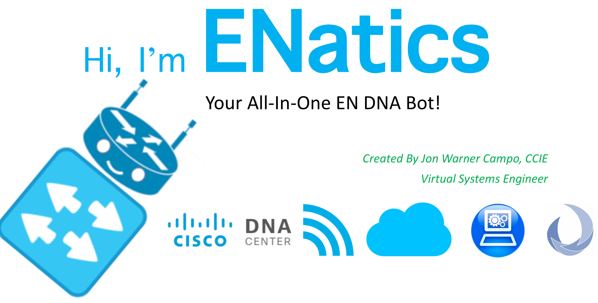
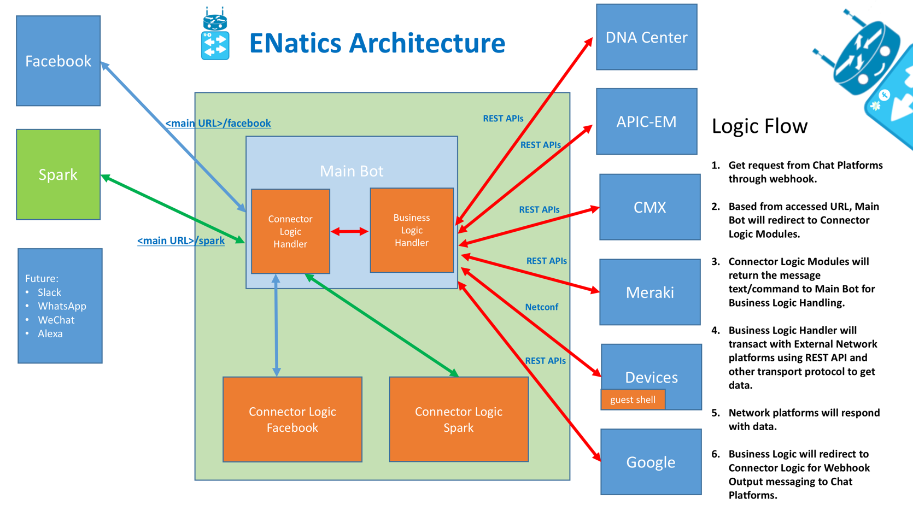
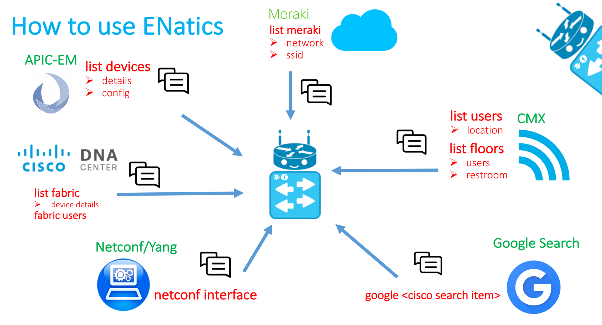

# ENatics-DNA-Bot
ENatics All-in-One DNA Bot

[Hi I'm ENatics! Your All-In-One EN DNA Bot! -> ENatics Presentation and Demo Video](https://youtu.be/lZmXtx_qcds)

Table of Contents
=================

   * [ENatics](#enatics)
   * [Table of Contents](#table-of-contents)
      * [Features](#features)
      * [Quick Usage](#quick-usage)
      * [Installation Guide](#installation-guide)
    * [Demo](#demo)

Created by [https://github.com/joncampo]

## Features

## Quick Usage

## Installation Guide

1. Download or clone ENatics
2. Install the modules/libraries from requirements.txt
3. Install Heroku Tools - https://toolbelt.heroku.com/
4. Create Heroku App - heroku create
5. Deploy using Heroku procedure below:
	a. git add .  
	b. git commit -m "Update"  
	c. git push heroku master  
6. Get the webhook URL using command -> Heroku open
6. Edit Settings.py and enter Platform IP Addresses and user/pass.  
	a. For Spark bot, Create and get the Bot Token from here - https://developer.ciscospark.com/apps.html  
	b. For Facebook bot, enter App ID from here -   
		i. Create a FB Bot Page  
		ii. Create App ID - https://developers.facebook.com/quickstarts/?platform=web  
		iii. Set the Heroku Open Webhook URL and verify token  
		***This is another nice reference for FB bot - https://blog.hartleybrody.com/fb-messenger-bot/  

## Demo

Message me on the following to see me work! 
Facebook - https://www.facebook.com/CiscoENatics  
Cisco Spark - ENatics@sparkbot.io   

Please See Presentation and Demo Video!
[ENatics Presentation and Demo Video](https://youtu.be/lZmXtx_qcds)
https://youtu.be/lZmXtx_qcds

Note: By using this software, you agree that the author has no liability whatsoever and you agree to Terms of Service and Privacy Policy.   
See Terms of Service - https://arcane-spire-45844.herokuapp.com/terms  
See Privacy Policy - https://arcane-spire-45844.herokuapp.com/privacy  
