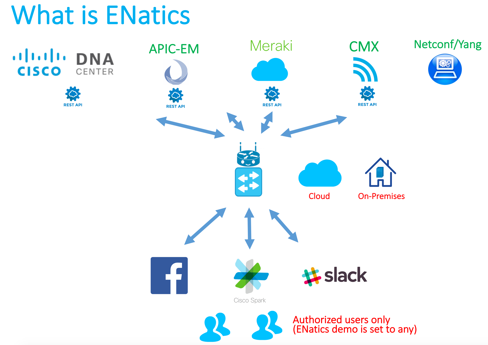

# ENatics-DNA-Bot
ENatics All-in-One DNA Bot

[Hi I'm ENatics! Your All-In-One EN DNA Bot! -> ENatics Presentation and Demo Video](https://youtu.be/lZmXtx_qcds)

Table of Contents
=================

   * [ENatics](#enatics)
   * [Table of Contents](#table-of-contents)
      * [Features](#features)
      * [Quick Usage](#quick-usage)
      * [Installation Guide](#installation-guide)
    * [Demo](#demo)

Created by [https://github.com/joncampo]

## Features

## Quick Usage

## Installation Guide

Installation Guide for Cloud Based ENatics Bot

A.	Preparation
1.	Download or clone ENatics from Github on your desktop- https://github.com/joncampo/ENatics-DNA-Bot.git 
2.	From your desktop, install Heroku Tools - https://toolbelt.heroku.com/ 
3.	Login to Heroku – heroku login 
4.	Create Heroku App - heroku create 
5.	Get the Heroku URL via this command – heroku open 

B.	Credentials 
1.	Create Bots in chat platforms: 
•	Spark 
a)	Create bot - https://developer.ciscospark.com/apps.html 
b)	Get the token 
•	Facebook 

a)	Create FB bot page - https://www.facebook.com/pages/create/ 
b)	Create App - https://developers.facebook.com/apps/ 
c)	Inside the app, go to messenger to subscribe to created FB bot page in Step A and get the token 
d)	Inside the app, go to webhook and enter the Heroku URL from Step A/4. Create and get the verify token. 
2.	Gather device IP/URL and username/password for any of the following: 
•	DNA Center 
•	APIC-EM 
•	CMX 
3.	Enter the Heroku App name, Bot tokens, device URL/IP and username/password on settings.py file in credentials folder.
4.	Important For Security! 
Perform the following:
•	Spark – edit spark_email.txt found in credentials folder. Replace any with authorized user Spark Email Accounts 
•	Facebook – Do not publish the FB Bot page. Add as admins the authorized user FB accounts 
•	Slack -  edit slack_username.txt found in credentials folder. Enter the authorized Slack user names. 
C.	Deploy 
1.	Secure connectivity options between Heroku Cloud and On-premises devices: 
a.	Perform port forwarding and allow https in Firewall between DNA platforms and Heroku public IPs 
b.	For paid Heroku deployment, establish SSL between Heroku cloud and customer network - https://devcenter.heroku.com/articles/ssl 

2.	Perform the following commands to deploy ENatics to Heroku cloud. 
a. git add .  
b. git commit -m "Update"  
c. git push heroku master 

## Demo

Message me on the following to see me work! 
Facebook - https://www.facebook.com/ENaticsBot  
Cisco Spark - ENatics@sparkbot.io   

Please See Presentation and Demo Video!
[ENatics Presentation and Demo Video](https://youtu.be/lZmXtx_qcds)
https://youtu.be/lZmXtx_qcds

Note: By using this software, you agree that the author has no liability whatsoever and you agree to Terms of Service and Privacy Policy.   
See Terms of Service - https://arcane-spire-45844.herokuapp.com/terms  
See Privacy Policy - https://arcane-spire-45844.herokuapp.com/privacy  
